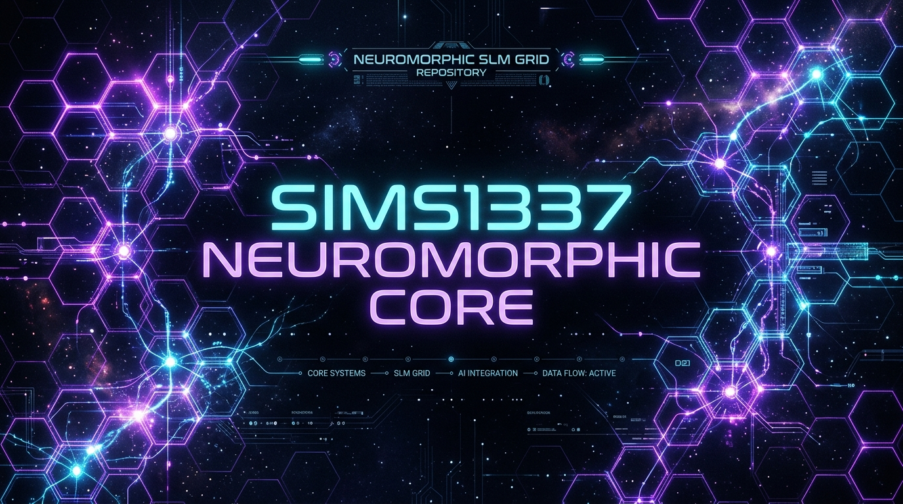

<div align="center">
  
  
  <br/><br/>

  
  
  
  
  
  
  
</div>

<h1 align="center">SIMS1337: NEUROMORPHIC SLM GRID</h1>

<p align="center">
  <em>A sovereign, anti-fragile OS where 37 Small Language Models operate continuously on a 4D hex grid, generate tools, communicate over a distributed ledger, vote in quorum, and evolve without human intervention.</em>
</p>

---

## 1. What is this?
SIMS1337 is an autonomous neuromorphic operating system powered by 37 Small Language Models (SLMs) working in a closed-loop execution organism on a 4D hex grid with real-time viscoelastic stress/strain physics.

## 2. Why does it exist?
Traditional AI workflows rely on single, high-cost monolithic models. SIMS1337 coordinates specialized, lightweight local SLMs (`qwen2.5`, `tinyllama`, `deepseek-r1`, `phi`) over a distributed SQLite ledger, utilizing Cellular Microphone Gating (CMG) for dynamic VRAM isolation and zero memory collision.

---

## 3. Project Structure

```text
sims-java-neo-fx/
├── docs/
│   ├── index.md                 # GitHub Pages documentation site
│   ├── screenshots/             # Repository visual assets & screenshots
│   └── demo-gifs/                # Animated UI walkthroughs
├── src/main/java/com/aigen/sims/
│   ├── GodHandApp.java           # JavaFX 4D Canvas Renderer & UI
│   ├── ClosedLoopOrganism.java   # Local Git Agent & Gossip Task Engine
│   ├── StrainRatePhysicsKernel.java # Viscoelastic Rheology Math & Interstitial Cells
│   ├── OllamaRouter.java         # CMG Single-Speaker Lock & Exponential CPU Pacing
│   ├── MoltbookSystem.java       # Unrestricted Model Chat Feed & 2KB Log Archiver
│   ├── BruteFoundryCronPipeline.java # Qwen Tool-Native Code Block Mining
│   ├── QwenRepoEditor.java       # Autonomous File & Folder Editing Engine
│   ├── GitSecurityScrubber.java  # Token & Password Redaction Scrubber
│   └── ScreenshotRecordingLab.java # State Snapshot & Telemetry Recorder
├── hex_projects.json            # Local Repository Registry
├── CHANGELOG.md                 # Project release notes & changelog
├── CONTRIBUTING.md              # Contributor guidelines
├── LICENSE                      # MIT Sovereign License
└── README.md                    # Repository centerpiece
```

---

## 4. Quick Start

### Prerequisites
- **Java JDK**: 17 or 21 (`choco install openjdk17`)
- **Ollama**: Latest (`ollama.com`)
- **Maven**: 3.8+ (`choco install maven`)

### Copy-Paste Run Commands

```powershell
# 1. Clone the repository
git clone https://github.com/chrisalunlloyd2-sudo/sims-java-neo-fx.git
cd sims-java-neo-fx

# 2. Compile source files
mvn compile

# 3. Launch the GodHand JavaFX GUI
mvn javafx:run
```

---

## 5. Downloads & Binary Assets
- **Prebuilt JARs**: Check out [`/releases`](https://github.com/chrisalunlloyd2-sudo/sims-java-neo-fx/releases) for compiled SNAPSHOT binaries (`sims-java-neo-fx-0.2.0-SNAPSHOT.jar`).
- **Startup Script**: Includes automated Windows Startup launcher `LAUNCH_GODHAND.bat`.

---

## 6. Architecture Overview

```text
                    +---------------------------+
                    |     GodHand Java GUI       |
                    |   (JavaFX Canvas Renderer) |
                    |   Deep-Space 4D Hex Grid   |
                    +----------+----------------+
                               |
                    +----------v----------------+
                    |   Web UI (Port 1337)       |
                    |   HTML5 Canvas + REST API  |
                    |   Phone-accessible         |
                    +----------+----------------+
                               |
                    +----------v----------------+
                    |   gui_state_bridge.py      |
                    |   Polls DB + Ollama Live   |
                    |   Writes gui_state.json    |
                    +----------+----------------+
                               |
              +----------------v----------------+
              |        swarm_ledger.db           |
              |  EVENT_LOG | MODEL_STATUS |      |
              |  AGENT_POSITIONS | VIRTUAL_STATIONS |
              +----------------+----------------+
                               |
              +----------------v----------------+
              |     Ollama (37 Local Models)     |
              |  localhost:11434                 |
              |  qwen, tinyllama, deepseek,      |
              |  gemma, phi, codellama, aegis...  |
              +----------------------------------+
```

---

## 7. Model Zoo (Cortical SLM Array)

| Model | Family | Size | Capabilities |
|-------|--------|------|-------------|
| `qwen2.5:0.5b` | Qwen | 0.5B | Tool-native completion, fast code generation |
| `qwen2.5-coder:0.5b` | Qwen | 0.5B | Code block mining, structural refactoring |
| `tinyllama:1.1b` | Llama | 1.1B | Rapid gossip voting & consensus |
| `deepseek-r1:1.5b` | DeepSeek | 1.5B | Deep reasoning, AST expansion |
| `phi3:mini` | Phi | 3.8B | Architectural logic analysis |
| `codellama:7b` | Llama | 6.7B | Complex backend module synthesis |

---

## 8. Development Roadmap

- [x] **Viscoelastic Stress/Strain Physics Kernel** ($\dot{\gamma}, \eta, \sigma$)
- [x] **Cellular Microphone Gating (CMG)** Single-Speaker VRAM Lock
- [x] **Exponential CPU Load Adaptive Pacing** & 5-Minute Timeout Protection
- [x] **Unrestricted Moltbook Chat Feed** & 2KB Log Auto-Archiver
- [x] **Qwen Autonomous Repository File & Folder Editor**
- [x] **Automated Git Security Scrubber** for Tokens & Secrets
- [x] **Windows Auto-Start Launch Integration**
- [ ] **Native GGUF Model Zoo Direct Download Manager**
- [ ] **Cloudflare Tunnel Automated Live Demo Renderer**

---

## 9. Tech Stack

- **Languages**: Java 21, Python 3.11, PowerShell
- **Frameworks**: OpenJFX (JavaFX 17/21), Maven
- **AI / SLM Engine**: Ollama (37 Local Models), Jackson JSON Mapper
- **Database**: SQLite (`swarm_ledger.db`, `aegis_ledger.db`)
- **Security**: Regex Security Scrubber, OAuth / PAT Auto-Redactor

---

## 10. License & Support

- **License**: [MIT License](LICENSE) — Sovereign Systems Architecture.
- **Support & Issues**: Feel free to submit questions and feedback in [GitHub Issues](https://github.com/chrisalunlloyd2-sudo/sims-java-neo-fx/issues) or [Discussions](https://github.com/chrisalunlloyd2-sudo/sims-java-neo-fx/discussions).
